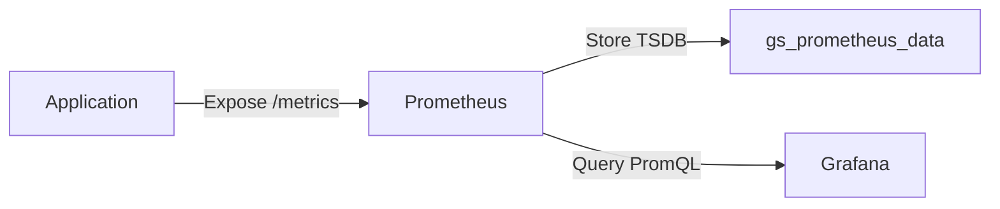
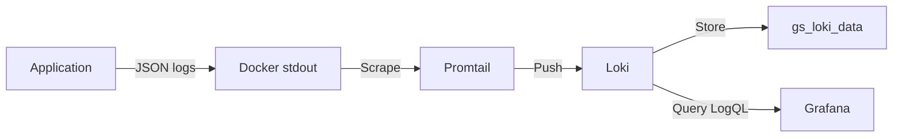
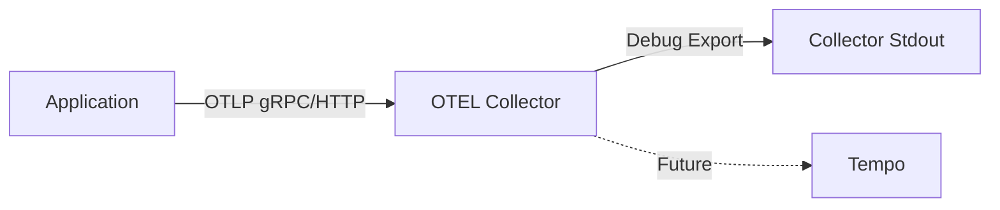

# Observability Architecture - GeniusSuite

**Status:** F0.3 Skeleton (validated via CI Validation workflow)  
**Last Updated:** 2025-11-15  
**Version:** 1.1.0

---

## 📋 Table of Contents

1. [Overview](#overview)
2. [Architecture Principles](#architecture-principles)
3. [Components](#components)
4. [Data Flow](#data-flow)
5. [Naming Conventions](#naming-conventions)
6. [Docker Compose Integration](#docker-compose-integration)
7. [Directory Structure](#directory-structure)
8. [F0.3 Skeleton Scope](#f03-skeleton-scope)
9. [Future Phases](#future-phases)
10. [References](#references)

---

## Overview

GeniusSuite's observability stack is built on industry-standard open-source tools to provide comprehensive monitoring, logging, and tracing capabilities across all suite applications. The architecture follows the **three pillars of observability**:

- **Metrics** - Quantitative measurements (Prometheus)
- **Logs** - Textual event records (Loki)
- **Traces** - Distributed request tracking (OTEL Collector → planned Tempo)

### Key Design Goals

1. **Zero-configuration for applications** - Apps export OTLP telemetry without custom logic
2. **Centralized collection** - Single OTEL Collector aggregates all telemetry
3. **Unified visualization** - Grafana as single pane of glass
4. **Docker-native** - Full stack runs as containers with named volumes for persistence
5. **Development-first** - F0.3 provides skeleton for local development; production hardening in later phases

---

## Architecture Principles

### 1. OpenTelemetry-First
All applications instrument telemetry using **OpenTelemetry SDK** (Node.js):
- Standardized instrumentation across suite
- Vendor-agnostic data format (OTLP)
- Auto-instrumentation for HTTP/gRPC/database calls

### 2. Pull & Push Hybrid Model
- **Metrics:** Prometheus **pulls** from `/metrics` endpoints (scrape model)
- **Logs:** Promtail **pushes** to Loki (aggregation model)
- **Traces:** Applications **push** OTLP to OTEL Collector (streaming model)

### 3. Network Isolation
Observability stack runs on dedicated Docker network:
- **`geniuserp_net_observability`** - Isolates monitoring traffic
- All services (apps, CP, backing services) connect to this network for metrics exposure
- Conforms to Zero-Trust network model (see `Strategie Docker: Volumuri, Rețele și Backup.md`)

### 4. Data Persistence
Critical data protected via named Docker volumes:
- `gs_prometheus_data` - TSDB for metrics (survives container recreation)
- `gs_loki_data` - Log chunks and indexes
- `gs_grafana_data` - Dashboards, users, settings
- Strategy: `external: true` prevents accidental deletion (see Docker Strategy doc)

---

## Components

### 1. OTEL Collector

**Image:** `otel/opentelemetry-collector:latest`  
**Container:** `geniuserp-otel-collector`  
**Ports:**
- `4317` - gRPC (OTLP protocol)
- `4318` - HTTP (OTLP protocol)

**Role:** Central aggregation point for all application telemetry.

**Configuration:** `otel-config/otel-collector-config.yml`

**Receivers:**
- `otlp/http` - HTTP/Protobuf endpoint for web apps
- `otlp/grpc` - gRPC endpoint for backend services

**Processors:**
- `batch` - Batches telemetry for efficient export

**Exporters (F0.3):**
- `debug` - Logs traces/metrics to stdout (verbosity: detailed)
- `prometheus` - Exposes metrics on `:8889` for Prometheus scraping
- *Tempo exporter planned for F0.4+ (traces persistence)*

**Data Flow:**
```
Applications → OTLP → OTEL Collector → Prometheus (metrics)
                                     → Debug logs (traces)
                                     → [Tempo - future]
```

### 2. Prometheus

**Image:** `prom/prometheus:latest`  
**Port:** `9090` (configurable via `OBS_PROMETHEUS_PORT`)  
**Volume:** `gs_prometheus_data:/prometheus`

**Role:** Time-series database for metrics storage and querying.

**Configuration:** `compose/prometheus.yml`

**Scrape Targets (F0.3):**
- **Control Plane Services** (7 services):
  - suite-shell (6151), suite-admin (6151), suite-login (6201)
  - identity (6251), licensing (6301), analytics-hub (6351), ai-hub (6401)
  
- **Stand-alone Apps** (8 services):
  - archify (6501), cerniq (6551), flowxify (6601), i-wms (6651)
  - mercantiq (6701), numeriqo (6751), triggerra (6801), vettify (6851)

- **Infrastructure:**
  - Traefik (9100) - Gateway metrics

**Scrape Interval:** 15s (global), 5s (Traefik)

**Metrics Endpoint Convention:** `http://<service>:<port+1>/metrics`  
Example: archify.app exposes health on `:6500`, metrics on `:6501`

**Rules:** `metrics/rules/traefik.rules.yml` (skeleton alert rule referenced by Prometheus)

### 3. Grafana

**Image:** `grafana/grafana-oss:latest`  
**Port:** `3000` (configurable via `OBS_GRAFANA_PORT`)  
**Volume:** `gs_grafana_data:/var/lib/grafana`

**Role:** Unified visualization and dashboarding platform.

**Configuration:**
- **Datasources:** `dashboards/grafana/datasources.yml` (pre-configured Prometheus, Loki, Tempo)
- **Dashboards:** `dashboards/grafana/dashboards.yml` (provisioning config)
- **Dashboard JSON:** `dashboards/grafana/dashboards/` (dashboard definitions)

**Authentication (F0.3 Dev):**
- Admin user: `${OBS_GRAFANA_ADMIN_USER:-admin}`
- Admin password: `${OBS_GRAFANA_ADMIN_PASS:-admin}`
- *Production auth via OIDC/SSO planned F0.4+*

**Access:** `http://localhost:3000`

### 4. Loki

**Image:** `grafana/loki:latest`  
**Port:** `3100` (configurable via `OBS_LOKI_PORT`)  
**Volume:** `gs_loki_data:/loki`

**Role:** Log aggregation and storage system (Prometheus for logs).

**Configuration:** Default embedded config (F0.3), custom config planned F0.4+

**Ingestion:** Via Promtail (push model)

**Query Language:** LogQL (similar to PromQL)

**Data Flow:**
```
Docker Containers → Promtail → Loki → Grafana Explore/Dashboards
```

### 5. Promtail

**Image:** `grafana/promtail:latest`  
**Port:** Internal only (9080)

**Role:** Log collection agent (sidecar pattern).

**Configuration:** `logs/ingestion/promtail-config.yml`

**Discovery:** Docker service discovery via `/var/run/docker.sock`

**Log Processing Pipeline:**
1. **Scrape:** All containers discovered via Docker API
2. **Parse:** JSON log format extraction (level, message, traceId)
3. **Label:** Container metadata (image, name, labels)
4. **Push:** Forward to Loki on `http://loki:3100/loki/api/v1/push`

**Expected Log Format (JSON):**
```json
{
  "level": "info",
  "message": "Request processed",
  "traceId": "abc123...",
  "service": "archify.app",
  "timestamp": "2024-11-13T10:00:00Z"
}
```

### 6. Tempo (Planned F0.4+)

**Status:** Not deployed in F0.3 skeleton.

**Purpose:** Distributed tracing backend (Jaeger alternative).

**Integration:** OTEL Collector will export traces to Tempo via `otlp/tempo` exporter.

**Current Workaround:** Traces logged to OTEL Collector stdout via `debug` exporter.

---

## Data Flow

### Metrics Flow



1. **Application** exposes OpenTelemetry metrics on `/metrics` endpoint (Prometheus format)
2. **Prometheus** scrapes endpoints every 15s (configured in `prometheus.yml`)
3. **Metrics stored** in local TSDB volume (`gs_prometheus_data`)
4. **Grafana queries** Prometheus datasource via PromQL

### Logs Flow



1. **Application** writes structured JSON logs to stdout/stderr
2. **Docker** captures container output
3. **Promtail** discovers containers via Docker API, parses JSON
4. **Promtail pushes** logs to Loki API
5. **Loki indexes** and stores log chunks in volume
6. **Grafana queries** Loki datasource via LogQL

### Traces Flow (F0.3 Limited)



1. **Application** sends OTLP traces to `http://geniuserp-otel-collector:4318`
2. **OTEL Collector** receives and batches traces
3. **Debug exporter** logs traces to collector stdout (F0.3 only)
4. **Tempo integration** planned for F0.4+ (persistent trace storage)

---

## Application SDK (Runtime Instrumentation)

The `shared/observability` workspace package encapsulates everything services need to publish telemetry. It currently exports:

| API | Location | Purpose |
| --- | --- | --- |
| `initTracing({ serviceName })` | `shared/observability/traces/otel.ts` | Boots the OpenTelemetry Node SDK with auto-instrumentations and an OTLP HTTP exporter (defaults to `http://localhost:4318/v1/traces` if `OTEL_EXPORTER_OTLP_ENDPOINT` is not set). |
| `initMetrics({ serviceName })` | `shared/observability/metrics/recorders/prometheus.ts` | Enables `prom-client` default collectors so every service exposes CPU, heap, event-loop, and GC metrics. |
| `metricsHandler()` | `shared/observability/metrics/recorders/prometheus.ts` | Serializes the registry contents; mount it on your `/metrics` HTTP route together with `promClient.contentType`. |
| `promClient` | `shared/observability/metrics/recorders/prometheus.ts` | Pass-through registry that lets services register custom counters/histograms and reuse the shared default instance. |

Usage snippet:

```ts
import { initMetrics, initTracing, metricsHandler, promClient } from '@genius-suite/observability';

await initTracing({ serviceName: 'cp/identity' });
await initMetrics({ serviceName: 'cp/identity' });

app.get('/metrics', async (_req, res) => {
  res.setHeader('Content-Type', promClient.contentType);
  res.send(await metricsHandler());
});
```

Place the tracing bootstrap right after env validation so it captures all auto-instrumented modules that load later in the process lifecycle.

---

## Naming Conventions

### Service Names

**Convention:** `<app-name>.app` or `cp/<service-name>`

Examples:
- `archify.app`
- `cp/identity`
- `cp/suite-shell`

**Used in:**
- OTEL `service.name` attribute
- Prometheus job names
- Loki labels
- Container names (prefixed with `geniuserp-`)

### OTEL Attributes (OpenTelemetry Semantic Conventions)

**Required attributes for all applications:**

| Attribute | Example | Description |
|-----------|---------|-------------|
| `service.name` | `archify.app` | Unique service identifier |
| `service.version` | `1.0.0` | Semantic version |
| `deployment.environment` | `dev` | Environment (dev/staging/prod) |
| `service.namespace` | `geniussuite` | Suite-wide namespace |

**Optional attributes (planned F0.4+):**
- `tenant.id` - Multi-tenancy support
- `user.id` - User context in traces
- `host.name` - Kubernetes node (production)

### Metric Names

**Convention:** OpenTelemetry metric naming (lowercase, underscores)

Examples:
- `http_server_request_duration_ms`
- `db_query_duration_ms`
- `cache_hit_rate`

**Labels:**
- `method` - HTTP method (GET, POST)
- `status` - HTTP status code (200, 404, 500)
- `endpoint` - API route (`/api/documents`)

### Log Labels (Loki)

**Injected by Promtail:**
- `container_name` - Docker container name
- `image` - Docker image name
- `job` - Scrape job name (`all-containers`)

**Parsed from JSON:**
- `level` - Log level (info, warn, error)
- `trace_id` - Correlation with traces

---

## Docker Compose Integration

### Network Architecture

Observability stack uses **dedicated internal network**:

```yaml
networks:
  observability:
    external: true
    name: geniuserp_net_observability
```

**All services connect to this network** to expose metrics endpoints. This follows the Zero-Trust network model (Tabelul 3.5):

**Network Mapping (Observability):**
| Service | net_observability | Purpose |
|---------|-------------------|---------|
| OTEL Collector | ✓ | Receive OTLP from all apps |
| Prometheus | ✓ | Scrape metrics from all apps |
| Loki | ✓ | Receive logs from Promtail |
| Grafana | ✓ | Query Prometheus/Loki |
| All Apps/CP | ✓ | Expose /metrics endpoints |

### Volume Management

**Named volumes with `external: false` (managed by compose):**

```yaml
volumes:
  gs_prometheus_data:
    name: gs_prometheus_data
  gs_loki_data:
    name: gs_loki_data
  gs_grafana_data:
    name: gs_grafana_data
```

**Lifecycle:**
- Created automatically by `docker compose up`
- **Persist across container recreations** (data safety)
- Deleted only with explicit `docker compose down -v` (in observability compose dir)

**Mount paths:**
- Prometheus: `/prometheus`
- Loki: `/loki`
- Grafana: `/var/lib/grafana`

### Environment Variables

**Configuration via `.observability.env`:**

```bash
OBS_PROMETHEUS_PORT=9090
OBS_GRAFANA_PORT=3000
OBS_GRAFANA_ADMIN_USER=admin
OBS_GRAFANA_ADMIN_PASS=admin
OBS_LOKI_PORT=3100
```

**Template:** `.observability.env.example` (committed to repo)

### Compose Profiles (F0.3)

**Location:** `shared/observability/compose/profiles/`

**Available profiles:**
- `compose.dev.yml` - Development profile (current F0.3 implementation)
- `compose.prod.yml` - Production profile (planned F0.4+)

**Usage:**
```bash
cd shared/observability
docker compose -f compose/profiles/compose.dev.yml up -d
```

---

## Directory Structure

```
shared/observability/
├── alerts/                       # Prometheus/Loki alert rules (planned F0.4+)
│   ├── prometheus/
│   └── loki/
├── compose/                      # Docker Compose configurations
│   ├── profiles/
│   │   └── compose.dev.yml      # F0.3 dev stack
│   └── prometheus.yml           # Prometheus scrape config (static targets)
├── dashboards/                   # Grafana dashboards
│   └── grafana/
│       ├── datasources.yml      # Prometheus, Loki, Tempo datasources
│       ├── dashboards.yml       # Dashboard provisioning config
│       └── dashboards/          # JSON dashboard definitions
├── docs/                         # Documentation
│   └── architecture.md          # This document
├── exporters/                    # Custom OTEL exporters (future)
├── logs/                         # Log collection configuration
│   ├── ingestion/
│   │   └── promtail-config.yml  # Promtail config
│   ├── parsers/                 # Log parsing rules (future)
│   ├── processors/              # Log enrichment (future)
│   ├── retention/               # Retention policies (future)
│   └── sinks/                   # Additional log sinks (future)
├── metrics/                      # Metrics helpers & rules
│   ├── recorders/
│   │   └── prometheus.ts        # prom-client helper exported to apps
│   └── rules/
│       └── traefik.rules.yml    # Example alerting rule (referenced by Prometheus)
├── otel-config/                  # OpenTelemetry configuration
│   └── otel-collector-config.yml # OTEL Collector pipeline
├── scripts/                      # Automation scripts
│   ├── install.sh               # Bootstrap observability stack
│   ├── validate.sh              # Infrastructure validation
│   ├── smoke.sh                 # Health check tests
│   └── README.md                # Scripts usage guide
├── traces/                       # Tracing configuration (Tempo - future)
├── .observability.env           # Environment variables (gitignored)
├── .observability.env.example   # Environment template
├── index.ts                     # TypeScript observability entry point
└── package.json                 # npm package for shared utilities
```

### Key Files

| File | Purpose | Phase |
|------|---------|-------|
| `compose/profiles/compose.dev.yml` | Docker stack definition | F0.3 ✓ |
| `otel-config/otel-collector-config.yml` | OTEL pipeline config | F0.3 ✓ |
| `compose/prometheus.yml` | Prometheus targets | F0.3 ✓ |
| `metrics/rules/traefik.rules.yml` | Example alert rule referenced by Prometheus | F0.3 ✓ (skeleton) |
| `metrics/recorders/prometheus.ts` | prom-client helper exported to apps | F0.3 ✓ |
| `traces/otel.ts` | OpenTelemetry SDK bootstrap | F0.3 ✓ |
| `logs/ingestion/promtail-config.yml` | Promtail scraping | F0.3 ✓ |
| `dashboards/grafana/datasources.yml` | Grafana datasources | F0.3 ✓ |
| `scripts/install.sh` | Stack bootstrap | F0.3 ✓ |
| `scripts/validate.sh` | Infrastructure checks | F0.3 ✓ |
| `scripts/smoke.sh` | Endpoint tests | F0.3 ✓ |
| `alerts/prometheus/*.yml` | Alert rules | F0.4+ |
| `traces/tempo-config.yml` | Tempo configuration | F0.4+ |

---

## F0.3 Skeleton Scope

### What F0.3 Includes ✓

**Infrastructure:**
- ✓ OTEL Collector (receives OTLP, exports to Prometheus)
- ✓ Prometheus (metrics storage + scraping)
- ✓ Grafana (visualization platform)
- ✓ Loki (log aggregation)
- ✓ Promtail (log collection from containers)

**Configuration:**
- ✓ Docker Compose dev profile (`compose.dev.yml`)
- ✓ OTEL Collector pipeline (traces → debug, metrics → Prometheus)
- ✓ Prometheus scrape config for all 15 services (CP + Apps)
- ✓ Promtail Docker discovery + JSON parsing
- ✓ Grafana datasource provisioning (Prometheus, Loki)
- ✓ Named volumes for data persistence

**Automation:**
- ✓ `install.sh` - Stack bootstrap script
- ✓ `validate.sh` - 38-check infrastructure validation
- ✓ `smoke.sh` - 33-endpoint health tests

**Documentation:**
- ✓ `scripts/README.md` - Script usage guide
- ✓ `docs/architecture.md` - This document

### What F0.3 Does NOT Include ✗

**Missing Components:**
- ✗ Tempo (distributed tracing storage) - traces logged to stdout only
- ✗ Alertmanager (alert routing/notification)
- ✗ Production profile (`compose.prod.yml`)
- ✗ Custom dashboards (only datasources configured)

**Missing Features:**
- ✗ Alert rules (Prometheus/Loki alerting)
- ✗ Log retention policies (manual cleanup required)
- ✗ Trace sampling strategies (all traces collected)
- ✗ Multi-tenancy (tenant_id filtering)
- ✗ Authentication/Authorization (Grafana basic auth only)
- ✗ High availability (single instance per service)
- ✗ Backup/restore procedures for volumes
- ✗ SSL/TLS encryption (plaintext communication)

**Known Limitations:**
1. **Traces not persisted** - OTEL Collector logs traces to stdout, no query/visualization
2. **No alerting** - Prometheus/Loki rules exist but Alertmanager not deployed
3. **Basic Grafana auth** - Admin/admin credentials, no SSO/OIDC
4. **Manual scrape targets** - Prometheus uses static config, no service discovery
5. **Single network** - All observability on one network (no isolation between metrics/logs/traces)
6. **Dev-only configuration** - Not production-ready (no resource limits, secrets management, HA)

---

## CI/CD Integration

The `.github/workflows/ci.yml` pipeline now enforces observability health on every pull request:

- **`validate` job** runs the Jest-based configuration suite (`__tests__/config/*.test.ts`) to ensure Husky, lint-staged, nx, and other repo policies stay aligned.
- **`observability-validate` job** boots the Docker Compose stack defined in `shared/observability/compose/profiles/compose.dev.yml`, provisions backing services, then executes `scripts/validate.sh` in `CI_MODE=true`. The script performs 38 structural checks (ports, volumes, critical endpoints, docker networks) while the workflow also confirms that all 15 application containers plus the observability stack stay healthy for the duration of the run.

The workflow surfaced the restart issues seen on 2025-11-14/15 and now serves as the gate before promoting changes to `dev → staging → master`.

---

## Future Phases

### F0.4 - Tempo Integration & Alerting

**Goals:**
- Deploy Tempo for distributed tracing storage
- Configure OTEL Collector to export traces to Tempo
- Implement basic alert rules (SLO-based)
- Deploy Alertmanager for notification routing

**Components:**
- `traces/tempo-config.yml` - Tempo configuration
- `alerts/prometheus/slo.rules.yml` - SLO alert rules
- `compose/profiles/compose.dev.yml` - Add Tempo + Alertmanager services

### F0.5 - Production Hardening

**Goals:**
- Production Docker Compose profile (`compose.prod.yml`)
- High availability setup (multi-replica for critical services)
- SSL/TLS encryption (Traefik as reverse proxy)
- Secrets management (HashiCorp Vault integration)
- Resource limits + autoscaling

**Components:**
- `compose/profiles/compose.prod.yml` - Production stack
- `compose/ha/` - HA configurations (Prometheus, Loki, Tempo)

### F0.6 - Advanced Features

**Goals:**
- Custom Grafana dashboards (SRE, business metrics)
- Log retention policies (automated cleanup)
- Trace sampling (head-based, tail-based)
- Multi-tenancy support (tenant filtering)
- OIDC/SSO authentication for Grafana

**Components:**
- `dashboards/grafana/dashboards/*.json` - Custom dashboards
- `logs/retention/policies.yml` - Loki retention config
- `traces/sampling/strategies.yml` - Trace sampling rules

### F0.7 - CI/CD Integration

**Goals:**
- Observability validation in GitHub Actions
- Automated performance testing (smoke tests in CI)
- Dashboard deployment via GitOps (Terraform)
- Alert rule versioning + testing

**Components:**
- `.github/workflows/observability-ci.yml` - CI pipeline
- `terraform/observability/` - IaC for observability stack

---

## References

### Internal Documentation

- **Strategic Plan:** `../../Plan/GeniusERP_Suite_Plan_v1.0.5.md`
- **Port Strategy:** `../../Plan/Strategii de Fișiere.env și Porturi.md` (Tabelul 4 & 5)
- **Docker Strategy:** `../../Plan/Strategie Docker_ Volumuri, Rețele și Backup.md` (Tabelul 2.4, 3.5)
- **Scripts Guide:** `../scripts/README.md`

### Configuration Files

- **OTEL Collector:** `../otel-config/otel-collector-config.yml`
- **Prometheus:** `../compose/prometheus.yml`
- **Promtail:** `../logs/ingestion/promtail-config.yml`
- **Grafana Datasources:** `../dashboards/grafana/datasources.yml`
- **Docker Compose:** `../compose/profiles/compose.dev.yml`

### External Resources

- [OpenTelemetry Specification](https://opentelemetry.io/docs/specs/otel/)
- [Prometheus Documentation](https://prometheus.io/docs/)
- [Grafana Documentation](https://grafana.com/docs/grafana/latest/)
- [Loki Documentation](https://grafana.com/docs/loki/latest/)
- [OTEL Collector Configuration](https://opentelemetry.io/docs/collector/configuration/)

---

## Quick Start

### 1. Start Observability Stack

```bash
cd /var/www/GeniusSuite/shared/observability
bash scripts/install.sh dev
```

### 2. Validate Infrastructure

```bash
bash scripts/validate.sh
# Expected: 38/38 checks passing
```

### 3. Run Smoke Tests

```bash
bash scripts/smoke.sh
# Expected: 33/33 endpoints OK
```

### 4. Access Dashboards

- **Grafana:** http://localhost:3000 (admin/admin)
- **Prometheus:** http://localhost:9090
- **Loki:** http://localhost:3100 (API only)

### 5. Query Metrics (Prometheus)

```promql
# Request rate per service
rate(http_server_requests_total[5m])

# Error rate
rate(http_server_requests_total{status=~"5.."}[5m])
```

### 6. Query Logs (Grafana Explore)

```logql
# All errors in last hour
{job="all-containers"} |= "error"

# Logs for specific service
{container_name="archify-app"} | json | level="error"
```

---

**Next Steps:**
- Review `scripts/README.md` for detailed script usage
- Explore Grafana datasources and create custom dashboards
- Configure application instrumentation (see OpenTelemetry SDK docs)
- Plan Tempo integration (F0.4) for trace persistence

**Feedback & Contributions:**
- Report issues/suggestions in GeniusSuite repo
- Update this doc when adding new components
- Version: Bump version number on major architectural changes
